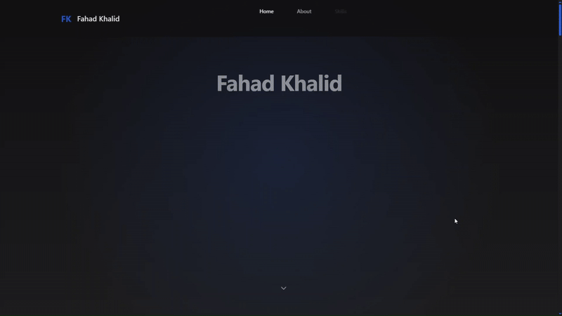
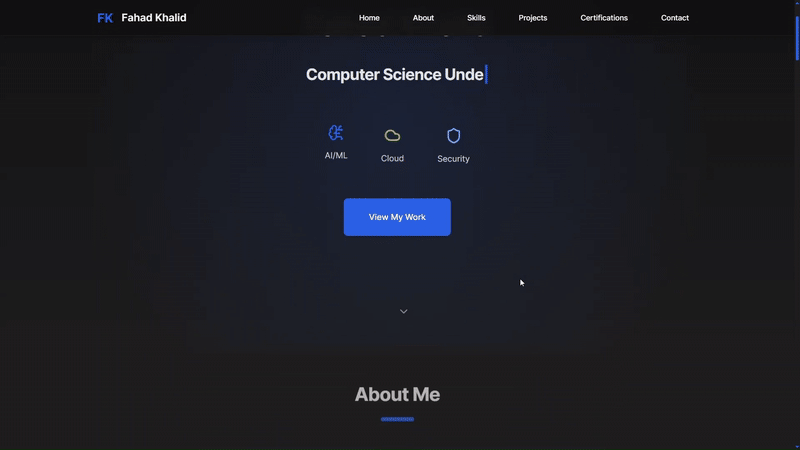
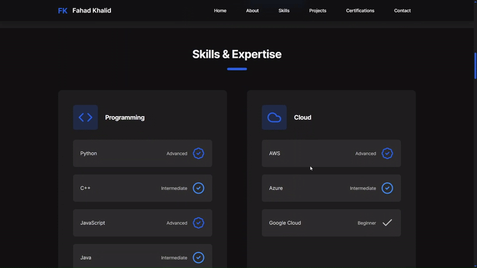
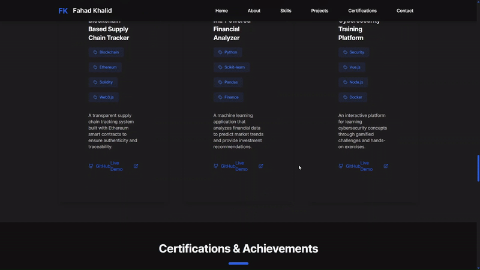
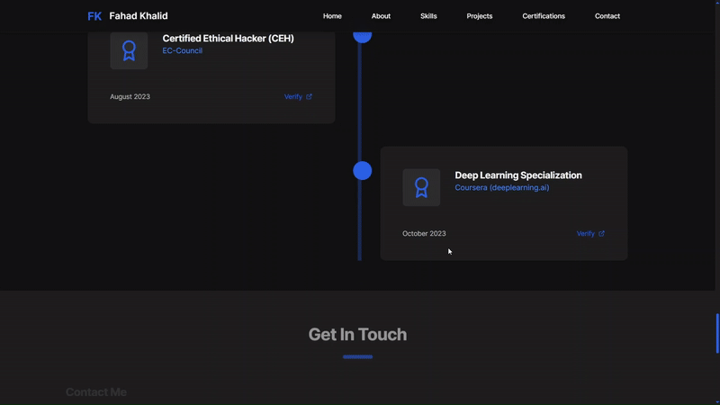

# Tech-Prortfolio-Web

---
[](https://opensource.org/licenses/MIT)
[](https://react.dev/)
[](https://vitejs.dev/)
[](https://tailwindcss.com/)
---

## 🚀 Overview

>This repository hosts the source code for my personal professional tech portfolio website. Designed to be clean, responsive, and highly customizable, this portfolio serves as a dynamic showcase of my skills, projects, certifications, and contact information. Built with modern web technologies, it provides a seamless experience across various devices.
---
## ✨ Features

* **Responsive Design:** Optimized for desktop, tablet, and mobile viewing.
* **Modular Components:** Easily manageable and reusable UI components.
* **Dynamic Content:** All portfolio data (projects, skills, certifications, social links) is managed through simple TypeScript files, allowing for quick updates without touching the core UI logic.
* **Clean & Modern UI:** Leverages Tailwind CSS for a utility-first approach to styling, ensuring a consistent and appealing aesthetic.
* **Fast Development:** Powered by Vite for an incredibly fast development server and optimized build process.
* **Showcase Sections:**
    * **Home:** Engaging introduction.
    * **About:** Personal background and professional summary.
    * **Skills:** Categorized display of technical proficiencies.
    * **Projects:** Detailed showcase of past work with descriptions and links.
    * **Certifications:** Highlighted professional achievements.
    * **Contact:** Easy ways to get in touch.
---
## 🛠️ Tech Stack

This project is built using the following key technologies:

* **Frontend Framework:** [React](https://react.dev/) (with TypeScript)
* **Build Tool:** [Vite](https://vitejs.dev/)
* **Styling:** [Tailwind CSS](https://tailwindcss.com/)
* **Language:** [TypeScript](https://www.typescriptlang.org/)
* **Package Manager:** [npm](https://www.npmjs.com/) (or [Yarn](https://yarnpkg.com/))
---
## 📁 Project Structure
The project follows a logical and modular structure to ensure maintainability and scalability:
```bash
Web_Project/
├── public/                 # Static assets (e.g., favicon, images)
├── src/
│   ├── components/         # Reusable UI components
│   │   ├── sections/       # Major page sections (About, Projects, etc.)
│   │   ├── Footer.tsx      # Footer component
│   │   └── Header.tsx      # Header/Navigation component
│   ├── data/               # Centralized data for easy customization
│   │   ├── certifications.ts
│   │   ├── projects.ts
│   │   ├── skills.ts
│   │   └── socialLinks.ts
│   ├── types/              # TypeScript type definitions
│   │   └── index.ts
│   ├── App.tsx             # Main application component
│   ├── index.css           # Global styles (Tailwind base, components, utilities)
│   └── main.tsx            # Entry point for the React application
├── .gitignore              # Files/directories to ignore in Git
├── index.html              # Main HTML file
├── package.json            # Project dependencies and scripts
├── tailwind.config.js      # Tailwind CSS configuration
├── tsconfig.json           # TypeScript configuration
├── vite.config.ts          # Vite build tool configuration
└── README.md               # This file
```
---
## ✍️ Customization
The portfolio is designed for easy content updates. All dynamic content is located in the ```src/data/``` directory:

* ```src/data/about.ts```: Update your personal summary.

* ```src/data/skills.ts```: Add or modify your skills.

* ```src/data/projects.ts```: Define your portfolio projects.

* ```src/data/certifications.ts```: List your professional certifications.

* ```src/data/socialLinks.ts```: Configure your social media and contact links.

Simply edit these TypeScript files to personalize the portfolio with your own information.

---
## 🖼️ Visual Showcase
#### 📷 Home Page  

#### 📷 About Me Page  

#### 📷 Skills Page  

#### 📷 Projects Page  

#### 📷 Certifications Page  

#### 📷 Contact Page  

---
## 📦 Getting Started

Follow these steps to get a local copy of the project up and running on your machine.

### Prerequisites

Before you begin, ensure you have the following installed:

* [Node.js](https://nodejs.org/en/) (LTS version recommended)
* [npm](https://www.npmjs.com/get-npm) (comes with Node.js) or [Yarn](https://yarnpkg.com/getting-started/install)

### Installation

1.  **Clone the repository:**

    ```bash
    git clone https://github.com/fahadkhalid695/Tech-Portfolio-Web.git
    cd Tech-Portfolio-Web
    ```

2.  **Install dependencies:**

    ```bash
    npm install
    # OR
    yarn install
    ```

### Running Locally

To start the development server:

```bash
npm run dev
# OR
yarn dev
```
---
## 🤝 Contributing
Contributions are welcome! If you have suggestions for improvements, feature requests, or find a bug, please open an issue or submit a pull request.

1. Fork the repository.
2. Create your feature branch ```git checkout -b feature/AmazingFeature```
3. Commit your changes ```git commit -m 'Add some AmazingFeature```
4. Push to the branch ```git push origin feature/AmazingFeature```
5. Open a Pull Request.

---

## 📄 License
Distributed under the MIT License. See ```LICENSE.md``` for more information.

---
## 📧 Contact
### [](mailto:your.email@example.com)
- fahadkhalid695@gmail.com
### [](https://www.linkedin.com/in/your-linkedin-profile/)
- [Fahad Khalid](https://www.linkedin.com/in/fahadkhalid695/)

